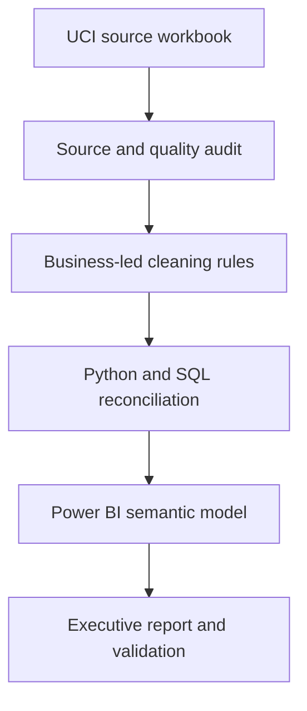
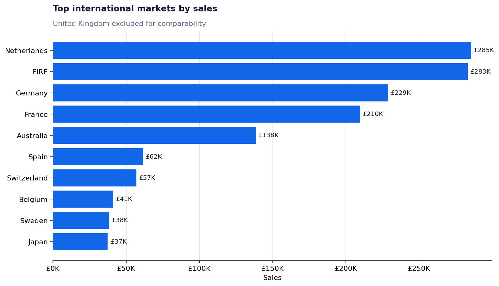

# Retail Performance Analytics

**A documented Business Intelligence project that turns retail transactions into a reliable executive performance view.**

This project analyses the UCI Online Retail dataset with Python, SQL and Power BI. The work covers source validation, business-led cleaning, KPI reconciliation, customer and product analysis, dimensional modelling and dashboard design.

> The Power BI report is being rebuilt from a documented specification. Design reference images are not presented as final analytical output; every published KPI must reconcile to the cleaned dataset.

## Project status

| Workstream | Status |
|---|---|
| Data understanding | Complete |
| Data cleaning and validation | Complete |
| Python business analysis | Complete |
| SQL reconciliation | Complete |
| KPI and semantic-model specification | Complete |
| Power BI visual rebuild | In progress |
| Final report validation | Pending complete PBIP project folder |

## Executive result

The analytical dataset contains completed retail sales after removing missing product descriptions, exact duplicate rows, non-positive quantities and negative unit prices.

| KPI | Verified result | Definition |
|---|---:|---|
| Sales | **£10,642,110.80** | Sum of `Quantity × UnitPrice` |
| Orders | **20,134** | Distinct completed invoice numbers |
| Identified customers | **4,339** | Distinct non-null customer IDs |
| Products sold | **3,925** | Distinct stock codes in completed sales |
| Average order value | **£528.56** | Sales divided by orders |
| Countries | **38** | Distinct transaction countries |

These metrics use one consistent cleaned population of **525,460 transaction lines**. Counts from the 541,909-row source are retained only in the data-quality analysis and are not mixed with cleaned sales KPIs.

## Business questions

1. How is the business performing overall?
2. How do sales and order value change over time?
3. Which markets contribute most revenue?
4. Which customers generate the greatest value?
5. Which physical products lead sales after operational charges are separated?
6. Which source limitations affect interpretation?

## Analytical workflow



## Data-quality reconciliation

| Stage | Rows | Change |
|---|---:|---:|
| Original source | 541,909 | — |
| Final analytical population | 525,460 | −16,449 |

The cleaning logic is intentionally conservative:

- rows without a product description are excluded because they are zero-value operational records;
- exact duplicate rows are removed;
- negative and zero quantities are excluded from completed-sales analysis;
- negative prices are excluded as accounting adjustments;
- zero-price rows remain visible for quantity and quality checks but contribute £0 to sales;
- missing customer IDs remain in sales totals but are excluded from customer-level metrics.

Full definitions are available in [Data quality and scope](docs/DATA_QUALITY.md) and [Metric definitions](docs/METRIC_DEFINITIONS.md).

## Important interpretation points

- The source ends on **9 December 2011**. December 2011 is a partial month and must not be interpreted as a confirmed sales decline.
- The United Kingdom contributes approximately **84.6%** of cleaned sales. International-market charts therefore exclude the UK only when their title states this explicitly.
- `DOTCOM POSTAGE`, `POSTAGE` and `Manual` generate revenue but are operational charges, not physical products. They are separated from merchandise rankings.
- Customer counts include only identified customers; anonymous transactions remain in company-level sales.




## Power BI report design

The report is specified as three connected pages:

1. **Executive Overview** — sales, orders, customers, products, average order value, monthly trend and market mix.
2. **Customer & Product Analysis** — top customers, merchandise performance, purchase frequency and order value.
3. **Data Quality & Definitions** — source-to-cleaned reconciliation, anonymous sales, operational records and KPI definitions.

The full layout, interaction and accessibility rules are documented in [Dashboard specification](docs/DASHBOARD_SPECIFICATION.md). The proposed star schema is documented in [Data model](docs/DATA_MODEL.md).

## Repository structure

```text
Retail-Performance-Analytics/
├── data/
│   ├── raw/                  # Original UCI workbook
│   └── processed/            # Locally generated analytical dataset
├── docs/                     # Scope, model, metrics and dashboard specification
├── images/                   # Reproducible documentation figures
├── notebooks/                # Data understanding, cleaning, analysis and SQL
├── powerbi/
│   ├── dax/                  # Versioned measures
│   └── theme/                # Report theme
├── scripts/                  # Reproducible validation and documentation assets
└── tests/                    # Metric and cleaning-rule checks
```

## Notebook roadmap

| Notebook | Purpose |
|---|---|
| `01_Data_Understanding.ipynb` | Audit structure, completeness, cancellations and source coverage |
| `02_Data_Cleaning.ipynb` | Apply and validate the completed-sales population |
| `03_business_analysis.ipynb` | Answer the core sales, customer, product, market and time questions |
| `04_SQL_Analysis.ipynb` | Reproduce the principal KPIs and rankings in SQL |

## Reproduce the analysis

The original workbook is sourced from the [UCI Online Retail dataset](https://archive.ics.uci.edu/dataset/352/online%2Bretail), licensed under CC BY 4.0.

Run the notebooks in numerical order. Notebook 02 creates the processed CSV used by notebooks 03 and 04.

```bash
python -m pip install -r requirements.txt
jupyter lab
```

Project validation and documentation figures can be regenerated from the command line:

```bash
python scripts/validate_retail_metrics.py
python scripts/generate_documentation_assets.py
python -m pytest -q
```

## Tools used

Python · pandas · matplotlib · seaborn · SQLite · SQL · Power BI · Power Query · DAX · GitHub Actions

## Source and license

- Dataset: [UCI Online Retail](https://doi.org/10.24432/C5BW33), Daqing Chen, licensed under CC BY 4.0.
- Project code and original documentation: [MIT License](LICENSE).
