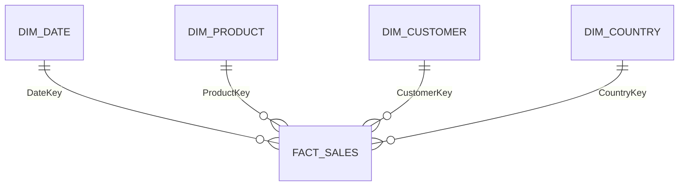

# Power BI data model

## Recommended model

Use a star schema with one sales fact and four dimensions.

## FactSales

Grain: one cleaned invoice line.

| Field | Type | Purpose |
|---|---|---|
| InvoiceNo | Text | Order identifier |
| StockCode | Text | Product identifier |
| CustomerID | Whole number, nullable | Identified customer |
| InvoiceDateTime | Date/time | Source transaction timestamp |
| DateKey | Date | Relationship to `DimDate` |
| Country | Text | Relationship to `DimCountry` |
| Quantity | Whole number | Units on the line |
| UnitPrice | Decimal | GBP price per unit |
| LineSales | Fixed decimal | Quantity × UnitPrice |

## DimDate

Create one row per date from 1 December 2010 to 9 December 2011, including year, month number, month name, month start, year-month label, day of week and `IsCompleteMonth`. December 2011 is incomplete.

## DimProduct

Use `StockCode` as the key. Because the source may contain multiple descriptions for one stock code, select a canonical non-null description deterministically, preferably the most frequently used description with latest date as a tie-breaker.

Add a classification field with `Merchandise` and `Operational charge`. At minimum, classify `DOTCOM POSTAGE`, `POSTAGE` and `Manual` as operational charges.

## DimCustomer

Use the non-null integer `CustomerID` as the key. Do not create an artificial named customer for missing IDs unless the report explicitly labels it as anonymous.

## DimCountry

Use the exact source country label as the key. Add a market grouping for `United Kingdom` and `International`.

## Relationships

- All relationships are one-to-many from dimension to fact.
- Use single-direction filtering.
- Avoid relationships directly between dimensions.
- Mark `DimDate` as the date table.
- Hide fact foreign keys and technical sort columns from report view.

## Reconciliation

Creating dimensions must not change fact-row count or executive KPIs. Reconcile the values in `METRIC_DEFINITIONS.md` before building visuals.
